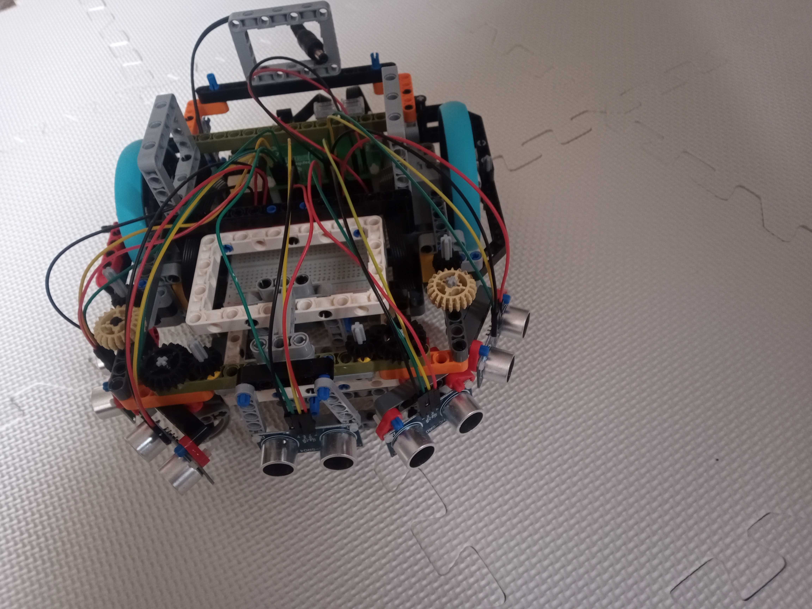

# buildhat-node-bot
This is the codebase for a differential drive robot that uses the raspberrypi buildhat to control the motors.  The buildhat is controled via its serial protocol using nodejs rather than the python library.

# important notes
This codebase is a first proof of concept that i have published for anyone that wants to follow what i am doing.

The buildhat is only used for motors, and the code to use it will be developed for this purpose only.

If you want to use it you probably need to figure out what the code does and modify it.

When the build hat turns on it does not have the firmaware on it so you need to run the npm-script load-firmaware (requires python) to load this before running other scripts.

There are paramters specific to my robot in this code, they are not all grouped in an obvious place (yet).
this is code that is being experimented with and developed at the same time.

the paramters of the pid control of speed may need to be tuned for your robot.  i will at some point add some graphing features and the ability to store and compare statistics for different pid values to make this easier.

it uses the serialprotocol for the buildhat via nodejs rather than the python library

# how can i use this
there are scripts in package.json that runs what it can do so far.

## what can it do so far
- contorl motors 
- emit motor tacho info as events
- contorl speed of motors using pid
- control translational and rotational speed of robot.
- read distance sensors (using pigpio via nodejs - not via the buildhat)

# why am i building this

1. the speed control via the python library is not fit for purpoose there is a delay between the motors start which just makes it spin round.
2. the python library uses threads to achieve concurrency, i wanted to use event loop style asynchronous programming.

# why i chose nodejs

I started with using asyncio in python but i am more familiar with nodejs and found it much easier to achieve what i wanted with it.  
In particular several parts of my codebase will have to react to the same events, the nodejs event emitter makes this easy.
I found that i could do some things with node in one declarative line that took many hard to follow lines of garbled code in python.
e.g. reading from the serial port.

# where am i going with this
I am actively developing this and it will change frequently
I will add more info here soon about what the code does and where i am going with it.